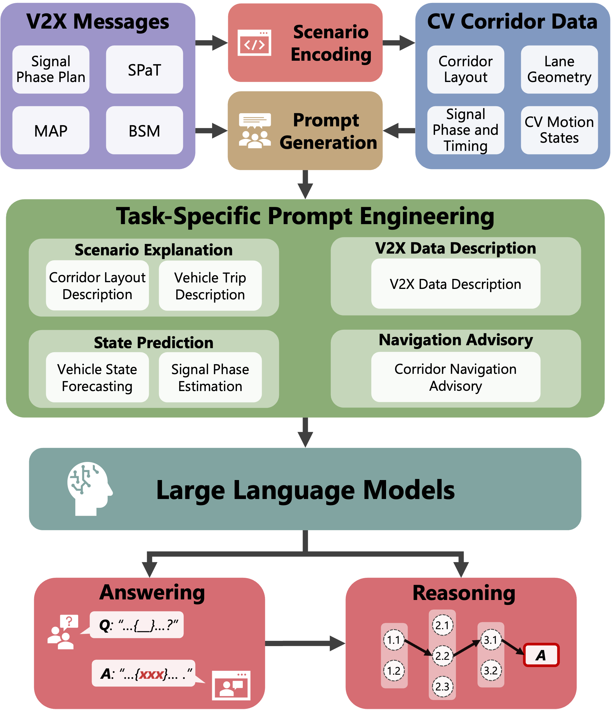

# V2X-LLM: Enhancing V2X Integration and Understanding in Connected Vehicle Corridors

## Overview

**V2X-LLM** is a framework that leverages **Large Language Models (LLMs)** to improve real-time **integration, analysis, and reasoning** of **Vehicle-to-Everything (V2X) data**. It enhances the understanding of connected vehicle corridors, offering intelligent decision support for traffic management.

📄 **Reference Paper**: [arXiv:2503.02239](https://arxiv.org/abs/2503.02239)

## Features

- **Scenario Explanation** – Generates narratives for complex traffic conditions.
- **V2X Data Description** – Provides structured insights into vehicle and infrastructure statuses.
- **State Prediction** – Forecasts future traffic states based on real-time V2X data.
- **Navigation Advisory** – Offers optimized routing guidance for enhanced mobility.

## Architecture

The framework integrates with **V2X data pipelines** and processes inputs such as:
- **Basic Safety Messages (BSMs)**
- **Signal Phase and Timing (SPaT) data**
- **Roadside Unit (RSU) communications**

<p align="center">
  
</p>


## Citation

If you use this framework in your research, please cite:

```bibtex
@article{wu2025v2x,
  title={V2X-LLM: Enhancing V2X Integration and Understanding in Connected Vehicle Corridors},
  author={Wu, Keshu and Li, Pei and Zhou, Yang and Gan, Rui and You, Junwei and Cheng, Yang and Zhu, Jingwen and Parker, Steven T and Ran, Bin and Noyce, David A and others},
  journal={arXiv preprint arXiv:2503.02239},
  year={2025}
}
